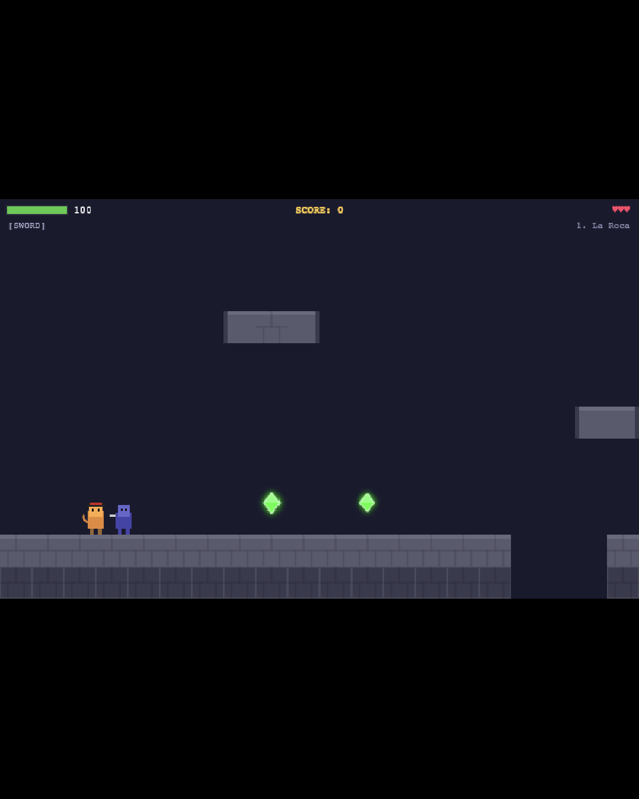
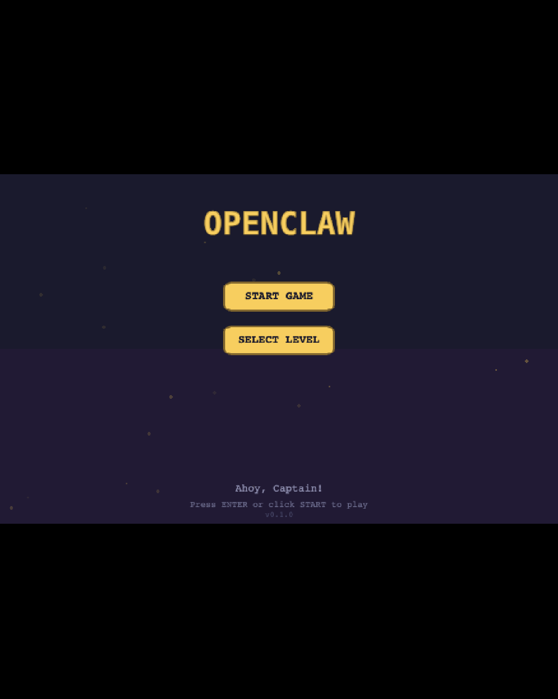

# Accidental OpenClaw Game

A side-scrolling platformer inspired by the classic **Captain Claw** (1997), accidentally built from scratch as a **Telegram Mini App** using Phaser 3 and TypeScript.



## How This Happened

### Captain Claw (1997) — The Original

**Captain Claw** was a side-scrolling platformer developed by **Monolith Productions** (the studio that would later create *F.E.A.R.* and *Shadow of Mordor*) and published by **Republic Interactive** in 1997. You played as Captain Nathaniel Joseph Claw, an anthropomorphic pirate cat fighting through 14 levels of enemies, traps, and boss battles to collect nine pieces of the Amulet of Nine Lives.

The game featured hand-drawn animation, tight platforming controls, and a surprisingly deep combat system with melee sword attacks and multiple ranged weapons (pistol, dynamite, magic claw). It became a cult classic — especially beloved across Eastern Europe, South Asia, and the Middle East, where it spread widely through shareware CDs in the late '90s and early 2000s.

Despite never achieving mainstream fame in the West, Captain Claw developed a fiercely loyal fanbase that kept the game alive for nearly three decades after its release.

### OpenClaw — The Open-Source Revival

In the 2010s, dedicated fans reverse-engineered the original game and created **[OpenClaw](https://github.com/pjasicek/OpenClaw)**, an open-source reimplementation built with C++ and SDL2. The project faithfully recreated the original levels, enemies, physics, and boss fights by parsing the original game's asset formats (REZ archives, WAP level files, ANI animation data). It was a remarkable labor of love that proved the game's mechanics could be preserved, modernized, and run on modern operating systems.

### This Project — The Accidental Reimagining

This whole thing started by accident. I was chatting with [Cursor](https://cursor.com)'s AI coding assistant and asked it what "OpenClaw" was. It looked up the open-source project, found the history of the original Captain Claw game, and explained the whole backstory. Somewhere in that conversation, we went from "huh, that's cool" to "...should we just build our own version?" to "okay let's make it a Telegram Mini App."

What followed was a single extended AI-assisted pair programming session where we built the entire game from scratch — not a port of the C++ OpenClaw codebase, but a completely new implementation designed to run inside the Telegram client. Every sprite is drawn on canvas at runtime. Every level is procedurally generated. There are zero external image or audio asset files. The whole thing just runs in a browser.

Nobody planned this. It just kind of happened.



## Features

- **14 levels** across 7 themed worlds (La Roca, Shipwreck Cliffs, Pirate's Cove, Dark Forest, Underwater Ruins, Tiger Island, and Captain's Tower)
- **16 enemy types** with unique AI behaviors and patrol patterns
- **7 boss fights** with multi-phase attack patterns (LeRauxe, Katherine, Wolvington, Gabriel, Marrow, Aquatis, Red Tail Omar)
- **Combat system** — melee sword + ranged weapons (pistol, dynamite, magic claw, fire sword)
- **Collectibles** — gems, gold, treasure, catnip power-ups, extra lives, and amulet pieces
- **Power-ups** — invincibility, fire sword, lightning sword, ice sword, health boosts
- **Checkpoints** with respawn system and 3 lives
- **Score system** with extra life at 1,000,000 points
- **Movement mechanics** — double jump, coyote time, responsive controls
- **Touch-first controls** for mobile/Telegram with full keyboard support on desktop
- **Canvas-generated sprites** — no external image assets needed
- **Procedural level generation** — unique layouts every playthrough
- **Telegram integration** — leaderboards, save/load via Telegram WebApp API
- **Parallax scrolling** backgrounds with atmospheric particles

## Tech Stack

| Component | Technology |
|-----------|------------|
| Game Engine | [Phaser 3](https://phaser.io/) |
| Language | TypeScript |
| Bundler | [Vite](https://vite.dev/) |
| Backend | Node.js + [Express](https://expressjs.com/) |
| Database | [SQLite](https://www.sqlite.org/) (via better-sqlite3) |
| Bot Framework | [grammY](https://grammy.dev/) |
| Telegram SDK | [@telegram-apps/sdk](https://docs.telegram-mini-apps.com/) |

## Project Structure

```
AccidentalOpenClawGame/
├── client/              # Phaser 3 game (TypeScript + Vite)
│   ├── src/
│   │   ├── scenes/      # Boot, Menu, Game, HUD scenes
│   │   ├── entities/    # Player, Enemy, Boss, Collectible, Projectile
│   │   ├── systems/     # Combat, Weapon, PowerUp, Particle systems
│   │   ├── utils/       # InputManager, TelegramBridge
│   │   ├── levels/      # Level configuration and generation
│   │   ├── config.ts    # Game constants and Phaser config
│   │   └── main.ts      # Entry point
│   └── index.html
├── server/              # Express REST API + SQLite
│   └── src/
│       ├── index.ts     # Server entry point
│       ├── routes/      # Auth, leaderboard, save/load endpoints
│       └── db/          # SQLite schema and queries
├── bot/                 # Telegram bot (grammY)
│   └── src/
│       └── index.ts     # Bot commands (/start, /scores, /help)
└── .env.example         # Environment variable template
```

## Quick Start

### Prerequisites

- Node.js 18+
- A Telegram Bot Token (from [@BotFather](https://t.me/BotFather)) — only needed for Telegram integration

### Development

```bash
# Clone the repository
git clone https://github.com/MisterMinter/AccidentalOpenClawGame.git
cd AccidentalOpenClawGame

# Install dependencies
cd client && npm install && cd ..
cd server && npm install && cd ..
cd bot && npm install && cd ..

# Start the game client (http://localhost:5173)
cd client && npm run dev

# (Optional) Start the API server (http://localhost:3001)
cd server && npm run dev

# (Optional) Start the Telegram bot
BOT_TOKEN=your_token WEBAPP_URL=https://your-url.com cd bot && npm run dev
```

The game client runs standalone — you only need the server and bot for Telegram leaderboard and save/load features.

### Environment Variables

Copy `.env.example` and fill in your values:

| Variable | Description |
|----------|-------------|
| `BOT_TOKEN` | Telegram bot token from BotFather |
| `WEBAPP_URL` | Deployed URL of the client app |
| `PORT` | Server port (default: 3001) |
| `VITE_API_URL` | API server URL for the client |

## Controls

### Mobile / Telegram (Touch)

The primary control scheme, designed for thumb-based play:

- **Left / Right buttons** — Move
- **Jump button** (arrow up) — Jump (tap twice for double jump)
- **Attack button** (sword) — Melee / ranged attack
- **Weapon button** (W) — Cycle through weapons

### Desktop (Keyboard)

Full keyboard support for browser play:

| Key | Action |
|-----|--------|
| Arrow keys / WASD | Move |
| Space / W / Up | Jump |
| Z / X | Attack |
| Tab | Switch weapon |
| Esc | Pause |

## Deployment

### Client

Build and deploy to any static hosting (Vercel, Netlify, GitHub Pages, etc.):

```bash
cd client && npm run build
# Deploy contents of client/dist/
```

### Server

```bash
cd server && npm run build
node dist/index.js
```

### Telegram Mini App Setup

1. Message [@BotFather](https://t.me/BotFather): `/newapp`
2. Select your bot
3. Set the Web App URL to your deployed client URL
4. Users can now open the game via the bot's menu button

## Acknowledgments

- **Monolith Productions** for creating the original Captain Claw (1997)
- **[pjasicek/OpenClaw](https://github.com/pjasicek/OpenClaw)** for the open-source C++/SDL2 reimplementation that kept the community alive
- The Captain Claw community for preserving and celebrating this classic for nearly 30 years
- Built with [Cursor](https://cursor.com)

## License

MIT
